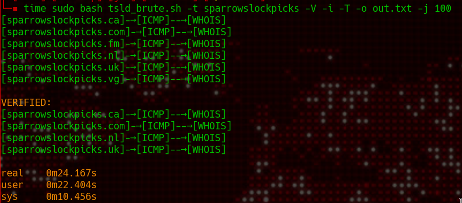

# TOP & SECOND LEVEL DOMAIN BRUTE FORCER

Brute force top and/or second level domain from word list and verification with whois.



## usage:

```
-s, --sld                      Test top AND second level domain
-c, --custom  [LIST]           Test a custom list (1 t/sld per line with dot)
-T, --tcp                    * TCP ping
-x, --http-port                TCP port 
-u, --udp                    * UDP ping
-X, --udp-port                 UDP port 
-i, --icmp                     ICMP ping (by default if no other protocol is specified)
-j, --jobs    [NUMBER]         Number of jobs
-t, --target  [BASEDOMAIN]     Base domain (ex: google)
-T, --timeout [NUMBER]         Timeout for ping
-o, --output  [FILE]           Output file
-v, --verify                   Fast verify with whois but some false positive
-V, --accurate-verify          Accurate verify with whois (slow)
```

### Lists

This list come with two list

- **TLD.txt** the default one with only top level domains.
- **TSLD.txt**  with top and second level domains (-s|--sld) for using it.

You can also use custom list (-c|--custom)

**custom list** must have this format:

```
.com
.fr
.co.uk
```

### TCP / UDP

Some servers are blocking ICMP, so you can scan using tcp or udp for a better accuracy.

TCP and UDP ping are using [nping](https://nmap.org/nping/) (come with nmap) and need root privilege.

If no protocol are specified the default one will be ICMP.
You can cumulate protocal as follow `-i -t -u`, it will after the first success.


### Jobs

Since bash dont use thread, it will use background jobs. `-j|--jobs` is the numer of background jobs you want to use (50 by default).


### Whois verification

Due to a huge amount of whois requests `-v` and limitation per second some false positives may occur (specialy for small "TLD" like fm vg ...).

Using `-V` will solve the problem by restarting the whois verification but without "treads" and with a `sleep 3` between each requests. Its slower but have a better accuracy.
